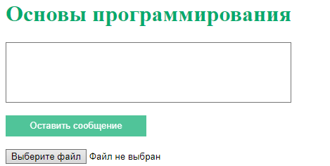
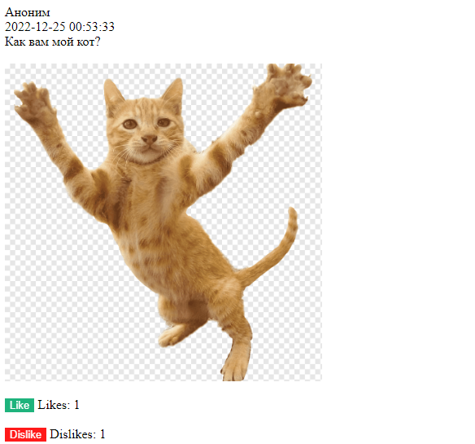
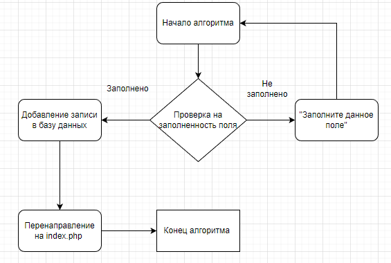
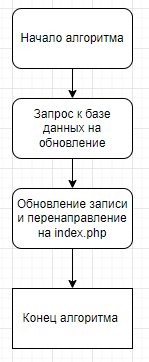
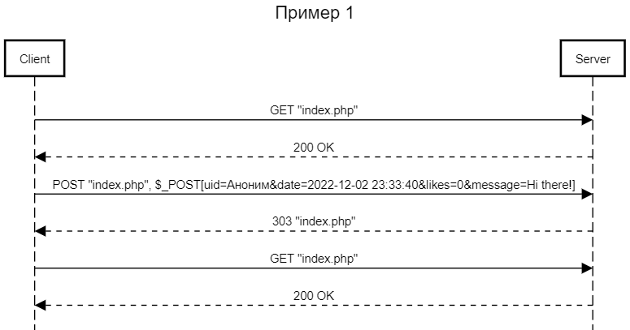
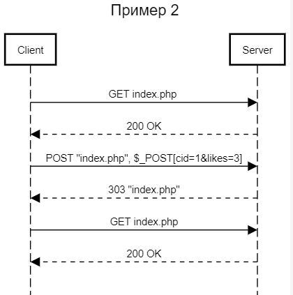

# ОТЧЁТ О ЛАБОРАТОРНОЙ РАБОТЕ №2
#### *По курсу "Основы Программирования"*
#### *Работу выполнил студент группы №3131 Беляев Д.Н.*
#### [Ссылка на GitHub](https://github.com/FireIceMage/Lab2.git)

## Цель работы:
Разработать и реализовать клиент-серверную информационную систему, реализующую механизм CRUD

## Ход работы
### Пользовательский интерфейс
1. Форма отправки сообщения                        
   
2. Чат пользователей                           
   

### Пользовательский сценарий
1. Пользователь попадает на страницу index.php и нажимает оставить сообщение. На экране появляется уведомление "Заполните это поле". Тогда он набирает текст и нажимает оставить сообщение и оно появляется на экране.  
2. Пользователь видит сообщение которое ему понравилось и нажимает кнопку Like. Счетчик лайков на данном посте увеличивается на 1.

### API сервера

В основе приложения использована клиент-серверная архитектура. Обмен данными между клиентом и сервером осуществляется с помощью HTTP GET и POST запросов. В теле POST запроса отправки поста используются следующие поля: comment. Для увеличения счётчика реакции используется форма с POST запросом. В теле POST запроса реакции используются следующие поля: cid, likes.

### Хореография
1. *Отправка сообщения*. Принимается введенное сообщение. Если поле оказалось пустым, то сайт просит запольнить его. Иначе отправляется запрос на добавление сообщения в базу данных, так же туда добавляется дата и время написания сообщения. Затем происходит перенаправление на страницу index.php. Из базы данных выводится данное сообщение с датой и временем его написания.
2. *Просмотр и оценка сообщений*. Кнопка like вызывает отправление запроса в базу данных на изменение количества лайков на определенном id сообщения.

## Описание структуры базы данных
Браузерное приложение phpMyAdminДля используется для просмотра содержимого базы данных. Всего 5 столбцов:
1. "cid" типа int с автоинкрементом для выдачи уникальных id всем сообщениям
2. "uid" типа varchar для хранения никнеймов пользователей
3. "date" типа datetime для хранения даты и времени отправления сообщения
4. "message" типа text для хранения сообщений
5. "likes" типа int для хранения количества лайков

## Описание алгоритмов
1. Алгоритм отправки сообщения                        
                                         
2. Алгоритм оставления реакции                                                   
                 


## Примеры HTTP запросов/ответов



## Значимые фрагменты кода
1. Функция отправки сообщения
```
function setComments($conn) {
    if (isset($_POST['commentSubmit'])) {
        $uid = $_POST['uid'];
        $date = $_POST['date'];
        $message = $_POST['message'];
        $likes = $_POST['likes'];
        $sql = "INSERT INTO comments (uid, date, message, likes) VALUES ('$uid', '$date', '$message', '$likes')";
        $result = $conn->query($sql);
        header('Location: index.php' );
    }
}
```
2. Функция вывода сообщений
```
function getComments($conn){
    $sql = "SELECT * FROM comments";
    $result = $conn->query($sql);
    while($row = $result->fetch_assoc()){
        echo "<div class='comment-box'><p>";
             echo $row['uid']."<br>";
             echo $row['date']."<br>";
             echo $row['message']."<br>";
             echo "<div>  <form method='POST' action='".likeSubmit($conn,$row)."'>  <button type='submit' name='".$row['cid']."' class='likeSubmit'>Like</button>  Likes: ".$row["likes"]."  </form></div>";
             echo "<hr>";
             echo "<p></div>";
    }
}
```
3. Функция оставления лайка
```
function likeSubmit($conn,$row) {
    if(isset($_POST[$row['cid']])) {
        $cid = $row['cid'];
        $likes = $row['likes']+1;
        $query = "UPDATE comments SET likes = '$likes' WHERE cid = '$cid'";
        $result = mysqli_query($conn, $query);
    }
}
```